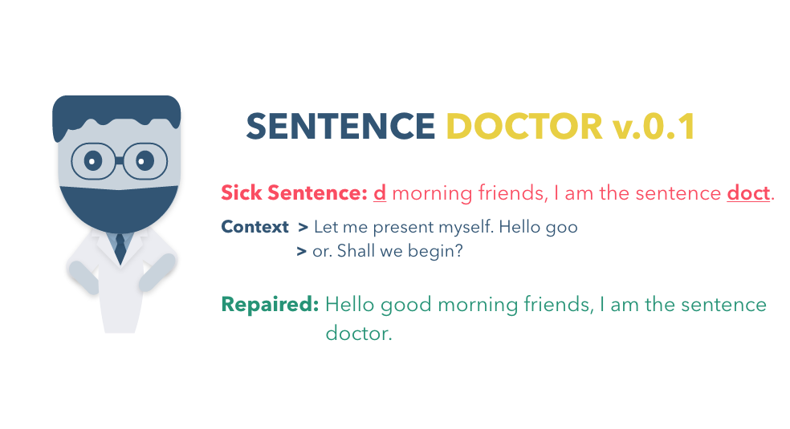

# Sentence-Doctor
Sentence doctor is a T5 model that attempts to correct the errors or mistakes found in sentences. Model works on English, German and French text.

## 1. Problem:
Many NLP models depend on tasks like *Text Extraction Libraries, OCR, Speech to Text libraries* and **Sentence Boundary Detection**
As a consequence errors caused by these tasks in your NLP pipeline can affect the quality of models in applications. Especially since models are often trained on **clean** input.

## 2. Solution:
Here we provide a model that **attempts** to reconstruct sentences based on the its context (sourrounding text). The task is pretty straightforward:
* `Given an "erroneous" sentence, and its context, reconstruct the "intended" sentence`.

## 3. Use Cases:
* Attempt to repair noisy sentences that where extracted with OCR software or text extractors.
* Attempt to repair sentence boundaries.
  * Example (in German): **Input: "und ich bin im**", 
    * Prefix_Context: "Hallo! Mein Name ist John", Postfix_Context: "Januar 1990 geboren."
    * Output: "John und ich bin im Jahr 1990 geboren"
* Possibly sentence level spelling correction -- Although this is not the intended use.
 * Input: "I went to church **las yesteday**" => Output: "I went to church last Sunday".
 
## 4. Disclaimer
Note how we always emphises on the word *attempt*. The current version of the model was only trained on **150K** sentences from the tatoeba dataset: https://tatoeba.org/eng. (50K per language -- En, Fr, De).
Hence, we strongly encourage you to finetune the model on your dataset. We might release a version trained on more data.

## 5. Datasets
We generated synthetic data from the tatoeba dataset: https://tatoeba.org/eng. Randomly applying different transformations on words and characters based on some probabilities. The datasets are available in the data folder (where **sentence_doctor_dataset_300K** is a larger dataset with 100K sentences for each language).

## 6. Usage

### 6.1 Preprocessing
* Let us assume we have the following text (Note that there are no punctuation marks in the text):

```python
text = "That is my job I am a medical doctor I save lives"
```
* You decided extract the sentences and for some obscure reason, you obtained these sentences:

```python
sentences = ["That is my job I a", "m a medical doct", "I save lives"]
```
* You now wish to correct the sentence **"m a medical doct"**.

Here is the single preprocessing step for the model:

```python
input_text = "repair_sentence: " + sentences[1] + " context: {" + sentences[0] + "}{" + sentences[2] + "} </s>"
```

**Explanation**:</br>
* We are telling the model to repair the sentence with the prefix "repair_sentence: "
* Then append the sentence we want to repair **sentence[1]** which is "m a medical doct"
* Next we give some context to the model. In the case, the context is some text that occured before the sentence and some text that appeard after the sentence in the original text.
 * To do that, we append the keyword "context :"
 * Append **{sentence[0]}** "{That is my job I a}". (Note how it is sourrounded by curly braces).
 * Append **{sentence[2]}** "{I save lives}". 
* At last we tell the model this is the end of the input with </s>.

```python
print(input_text) # repair_sentence: m a medical doct context: {That is my job I a}{or I save lives} </s>
```

<br/>

**The context is optional**, so the input could also be ```repair_sentence: m a medical doct context: {}{} </s>```

### 6.2 Inference

```python

from transformers import AutoTokenizer, AutoModelWithLMHead

tokenizer = AutoTokenizer.from_pretrained("flexudy/t5-base-multi-sentence-doctor")

model = AutoModelWithLMHead.from_pretrained("flexudy/t5-base-multi-sentence-doctor")

input_text = "repair_sentence: m a medical doct context: {That is my job I a}{or I save lives} </s>"

input_ids = tokenizer.encode(input_text, return_tensors="pt")

outputs = model.generate(input_ids, max_length=32, num_beams=1)

sentence = tokenizer.decode(outputs[0], skip_special_tokens=True, clean_up_tokenization_spaces=True)

assert sentence == "I am a medical doctor."
```

## 7. Fine-tuning
We also provide a script `train_any_t5_task.py` that might help you fine-tune any Text2Text Task with T5. We added #TODO comments all over to help you use train with ease. For example:

```python
# TODO Set your training epochs
config.TRAIN_EPOCHS = 3
``` 
If you don't want to read the #TODO comments, just pass in your data like this

```python
# TODO Where is your data ? Enter the path
trainer.start("data/sentence_doctor_dataset_300.csv")
```
and voila!! Please feel free to correct any mistakes in the code and make a pull request.

## 8. Attribution
* [Huggingface](https://huggingface.co/) transformer lib for making this possible
* Abhishek Kumar Mishra's transformer [tutorial](https://github.com/abhimishra91/transformers-tutorials/blob/master/transformers_summarization_wandb.ipynb) on text summarisation. Our training code is just a modified version of their code. So many thanks.
* We finetuned this model from the huggingface hub: WikinewsSum/t5-base-multi-combine-wiki-news. Thanks to the [authors](https://huggingface.co/WikinewsSum)
* We also read a lot of work from [Suraj Patil](https://github.com/patil-suraj)
* No one has been forgotten, hopefully :)
